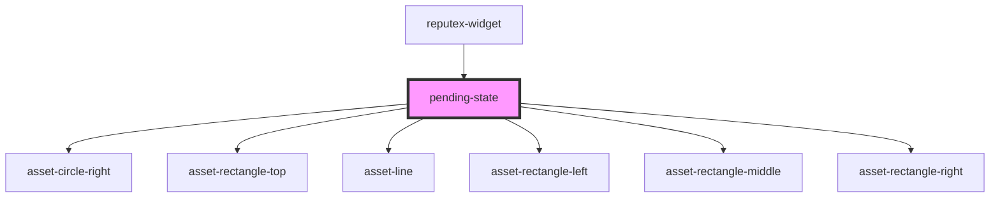

# my-button

<!-- Auto Generated Below -->

## Properties

| Property      | Attribute      | Description | Type      | Default     |
| ------------- | -------------- | ----------- | --------- | ----------- |
| `bodyMessage` | `body-message` |             | `string`  | `undefined` |
| `mode`        | `mode`         |             | `boolean` | `undefined` |

## Dependencies

### Used by

 - [reputex-widget](../reputex-widget)

### Depends on

- [asset-circle-right](../asset-circle-right)
- [asset-rectangle-top](../asset-rectangle-top)
- [asset-line](../asset-line)
- [asset-rectangle-left](../asset-rectangle-left)
- [asset-rectangle-middle](../asset-rectangle-middle)
- [asset-rectangle-right](../asset-rectangle-right)

### Graph

----------------------------------------------

*Built with [StencilJS](https://stenciljs.com/)*
